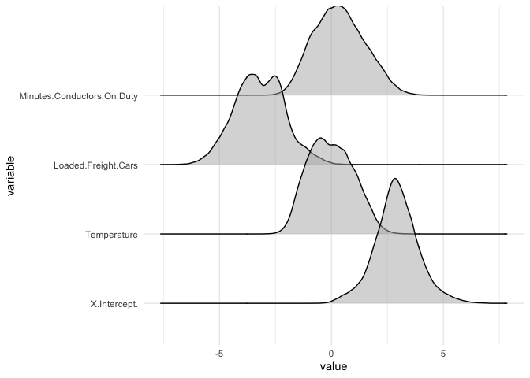

Submitting Jobs To The CRC
================

If you need a quick example of what goes into submitting jobs to the
CRC, we have you covered here. This document is not for getting
connected, making directories, or configuring anything – instead, it is
to give you a demonstration of submitting a sequential job and a
parallel job. The folders in this repo contain R code – `r_files` – and
submission scripts – `script_files`.

## Submission Examples

### Single

#### Submission Script

The submission script below, `sequential_job.sh` tells the CRC what R
script that you want to run.

We will be submitting an R script named `sequential_example.R`

``` bash
#!/bin/bash

#$ -N test                 # Specify job name
#$ -M your.email@nd.edu  # Notification email
#$ -m abe                  # abort, begin, end

module load R 

R CMD BATCH sequential_example.R  sequential.out
```

Once you have navigated to the directory where you have saved this
script, you can submit it like this:

``` bash
qsub sequential_job.sh
```

#### R Code

This is the R code – `sequential_example.R` – that you are submitting in
`sequential_job`. Notice the spot where this data lives and adapt to
reflect your own netID.

``` r
rail <- read.csv(
  "/afs/crc.nd.edu/user/s/sberry5/wrangling_test/Rail_Equipment_Accident_Incident_Data.csv"
  )

rail$casualty <- rail$Total.Persons.Injured + rail$Total.Persons.Killed

subset_data <- rail[, c("casualty", "Temperature", 
                        "Loaded.Freight.Cars", "Minutes.Conductors.On.Duty")]

bootstraps <- 100

output <- lapply(1:bootstraps, function(x) {
  
  sample_rows <- sample(x = 1:nrow(rail), 
                        size = 10000, 
                        replace = TRUE)
  
  sample_data <- rail[sample_rows, ]
  
  simple_model <- lm(
    casualty ~ 
      Temperature + 
      Loaded.Freight.Cars + 
      Minutes.Conductors.On.Duty, 
    data = sample_data)
  
  model_summary <- summary(simple_model)
  
  t_result <- data.frame(t(model_summary$coefficients[, 't value']))
  
  t_result
})

output <- do.call(rbind, output)

save(
  output, 
  file = "/afs/crc.nd.edu/user/s/sberry5/wrangling_test/bootstraps.RData"
)
```

The most important part here is the save – do not forget to save your
output.

### Parallel

While submitting a parallel job requires the same two files – a job
script and R code – the set-up is a bit different.

#### Submission Script

In `parallel_job.sh` below, you’ll see that we are using a machine named
`mpi-24` and saying that we are going to use 24 cores on that machine.

The `$NSLOTS` environment variable is something that we will reference
in our R code later.

We will be submitting a job called `parallel_example.R`.

``` bash
#!/bin/tcsh

#$ -pe mpi-24 24        # Specify parallel environment and legal core size
#$ -q debug             # Specify queue, debug is up to 4 hours, long is 14 days
#$ -N big_boot          # Specify job name
#$ -M your.email@nd.edu # Notification email
#$ -m abe                 # abort, begin, end

module load R 

mpirun -np $NSLOTS  Rscript parallel_example.R > parallel_example.out
```

#### R Code

There isn’t too much different in this code, with the exception of a few
packages and the presence of `options(cores = Sys.getenv("NSLOTS"))` –
the same `NSLOTS` that we used in our submission file.

``` r
library(doParallel)
library(foreach)
library(parallel)

rail <- read.csv(
  "/afs/crc.nd.edu/user/s/sberry5/wrangling_test/Rail_Equipment_Accident_Incident_Data.csv"
  )

rail$casualty <- rail$Total.Persons.Injured + rail$Total.Persons.Killed

subset_data <- rail[, c("casualty", "Temperature", 
                        "Loaded.Freight.Cars", "Minutes.Conductors.On.Duty")]

bootstraps <- 100000

options(cores = Sys.getenv("NSLOTS"))
getOption('cores')

foreach_bootstrap <- foreach(i = 1:bootstraps, .combine = "rbind") %dopar% {
  
  sample_rows <- sample(x = 1:nrow(subset_data), 
                        size = 10000, 
                        replace = TRUE)
  
  sample_data <- subset_data[sample_rows, ]
  
  simple_model <- lm(
    casualty ~ Temperature + 
      Loaded.Freight.Cars + 
      Minutes.Conductors.On.Duty, 
    data = sample_data
  )
  
  model_summary <- summary(simple_model)
  
  t_result <- data.frame(t(model_summary$coefficients[, 't value']))
  
  t_result
}

save(
  foreach_bootstrap, 
  file = "/afs/crc.nd.edu/user/s/sberry5/wrangling_test/big_boot_out.RData"
)

proc.time()
```

## Results

Running 100000 bootstrap samples on this model took a little over 26
minutes – that certainly saved our computer a lot of effort.

Notice that we saved our data out in an RData object called
`big_boot_out.RData`. Let’s see what we can actually do with it.
Important to note that it isn’t the most interesting model in the world,
but is there only to serve as a demonstration.

``` r
load("data/big_boot_out.RData")
```

Now that we have our data loaded in, I’d be curious to see the
distribution of our *t*-statistics for our features.

``` r
library(ggplot2)
library(ggridges)
library(reshape2)

melted_samples <- melt(foreach_bootstrap)

ggplot(melted_samples, aes(value, variable)) +
  geom_density_ridges(alpha = .5) +
  theme_minimal()
```

<!-- -->

There is clearly something interesting going on with the number of
loaded freight cars and its effect on total casualties.
